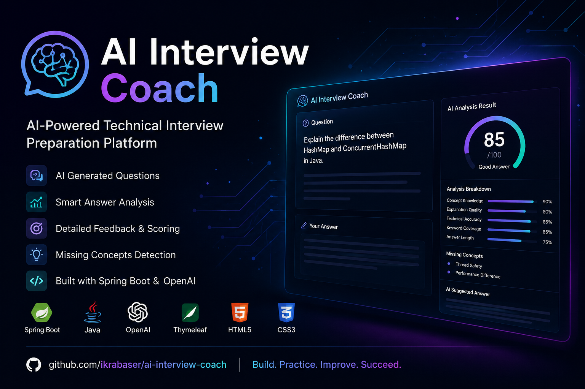
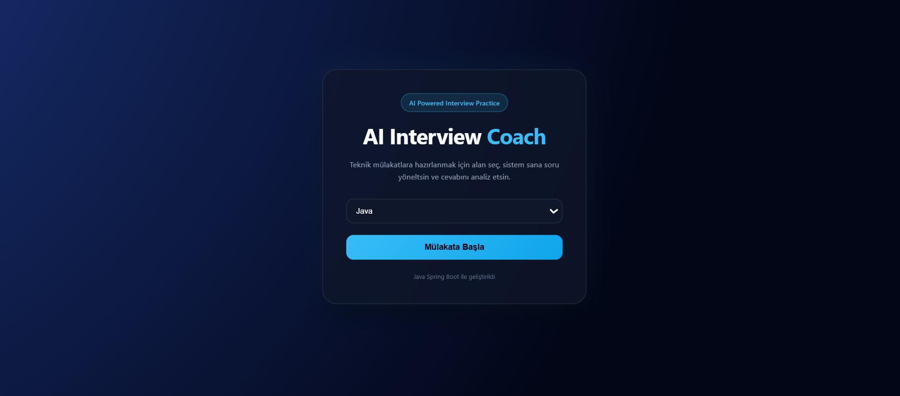
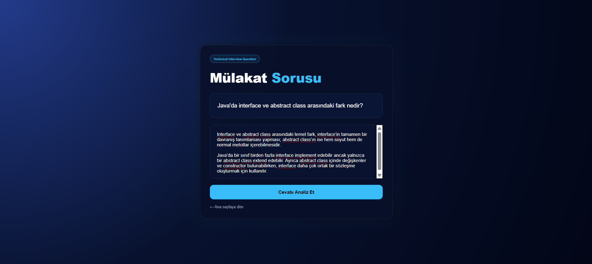
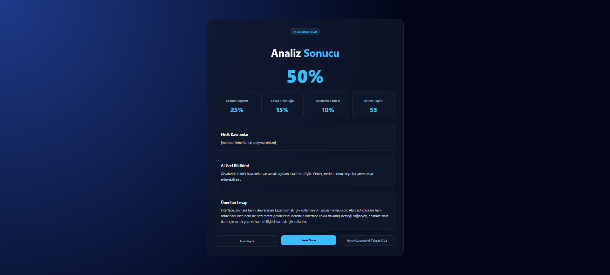
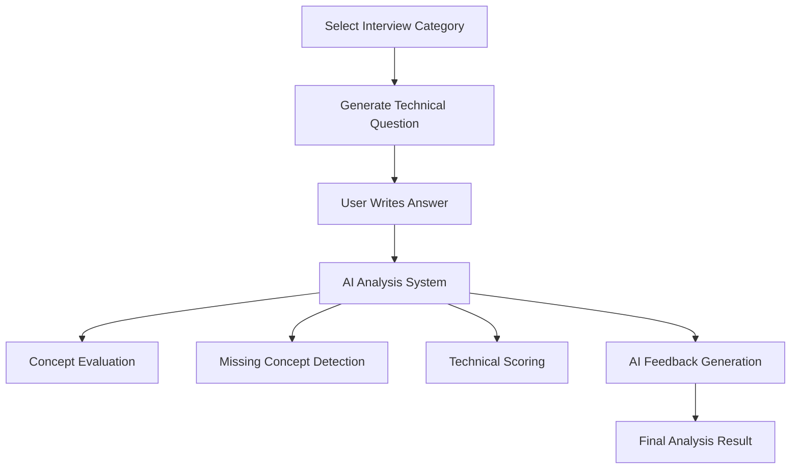

# 🤖 AI Interview Coach

<p align="center">
  
</p>

<p align="center">


</p>

---

## 🌟 Overview

**AI Interview Coach** is an AI-powered technical interview preparation platform developed using **Java Spring Boot** and **OpenAI API** integration.

The system generates technical interview questions, analyzes user answers, evaluates concept coverage, detects missing technical concepts, and provides intelligent feedback with professional answer suggestions.

Designed with a modern dark-themed interface and real-time AI analysis experience.

---

# ✨ Features

- 🎯 AI-generated technical interview questions
- 🧠 Intelligent answer analysis system
- 📊 Dynamic scoring algorithm
- 📝 Missing concept detection
- 💡 AI feedback generation
- 📚 Suggested professional answers
- 🌐 Modern responsive UI
- ⚡ Spring Boot backend architecture
- 🤖 OpenAI API integration
- 📈 Technical keyword evaluation
- 🔍 Concept coverage analysis

---

# 🖼️ Application Screenshots

## 🏠 Landing Page

<p align="center">
  
</p>

---

## ❓ Interview Question Screen

<p align="center">
  
</p>

---

## 📊 AI Analysis Result

<p align="center">
  
</p>

---

# 🛠️ Technologies Used

| Technology | Purpose |
|---|---|
| Java 17 | Backend Development |
| Spring Boot | Web Application Framework |
| Thymeleaf | Template Engine |
| OpenAI API | AI Question & Analysis System |
| HTML5 | Frontend Structure |
| CSS3 | UI Design |
| Maven | Dependency Management |

---

# 📂 Project Structure

```bash
src/
 ├── main/
 │   ├── java/com/ikra/ai_interview_coach/
 │   │   ├── controller/
 │   │   │   └── InterviewController.java
 │   │   │
 │   │   ├── service/
 │   │   │   └── AIAnalysisService.java
 │   │   │
 │   │   └── AiInterviewCoachApplication.java
 │   │
 │   └── resources/
 │       ├── templates/
 │       │   ├── index.html
 │       │   ├── question.html
 │       │   └── result.html
 │       │
 │       └── application.properties
 │
 └── test/
```

---

# ⚙️ How It Works



---

# 📈 Evaluation Metrics

The AI evaluates answers based on:

- ✅ Technical Concept Knowledge
- ✅ Explanation Quality
- ✅ Technical Accuracy
- ✅ Keyword Coverage
- ✅ Missing Concepts
- ✅ Answer Length
- ✅ AI Feedback Quality

---

# 🧠 Example AI Capabilities

✔️ Technical concept detection  
✔️ Smart answer evaluation  
✔️ AI-generated feedback  
✔️ Missing keyword analysis  
✔️ Suggested professional answers  
✔️ Dynamic scoring system  

---

# 🔮 Planned Improvements

- 🔐 JWT Authentication System
- 🗄️ PostgreSQL Integration
- 📜 User Answer History
- 🧑‍💼 Admin Dashboard
- 🐳 Docker Deployment
- ☁️ Railway / Render Deployment
- 🎙️ Voice-Based Interview Simulation
- 📊 Circular Progress Charts
- 🧠 Advanced AI Scoring Models
- ⚡ Real-Time Writing Analysis
- 🎯 Junior / Mid / Senior Difficulty Levels

---

# ▶️ Run Locally

## Clone Repository

```bash
git clone https://github.com/ikrabaser/ai-interview-coach.git
```

---

## Navigate to Project Folder

```bash
cd ai-interview-coach
```

---

## Run Application

### Linux / macOS

```bash
./mvnw spring-boot:run
```

### Windows

```bash
mvnw.cmd spring-boot:run
```

---

# 🔑 Environment Variables

Create an `application.properties` file:

```properties
openai.api.key=YOUR_API_KEY
```

---

# 🌍 Future Vision

AI Interview Coach aims to evolve into a fully interactive AI-based software engineering interview simulation platform capable of evaluating candidates in real time with adaptive AI scoring systems and intelligent feedback mechanisms.

---

# 👩‍💻 Developer

## Leyla İkra Başer

Computer Engineering Student  
AI & Software Development Enthusiast

🔗 GitHub:  
https://github.com/ikrabaser

---

<p align="center">
  <b>Build. Practice. Improve. Succeed.</b>
</p>
